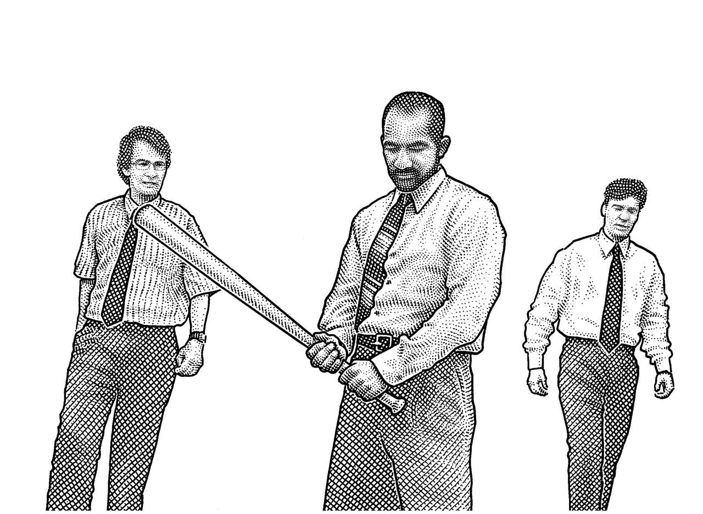

Desk sheets for you to reference in your office space. 

How to do the things
Good day!

Here are some reference sheets. They could be hotkeys, programming functions, or something else.

I've built an index of them in the attached Coder_reference-sheets.xlsx file.

It is in the directory: Coder-reference-sheets/Pivot-table-ized-refs/

This file has pivot tables and slicers (filters) galore. Enjoy!
